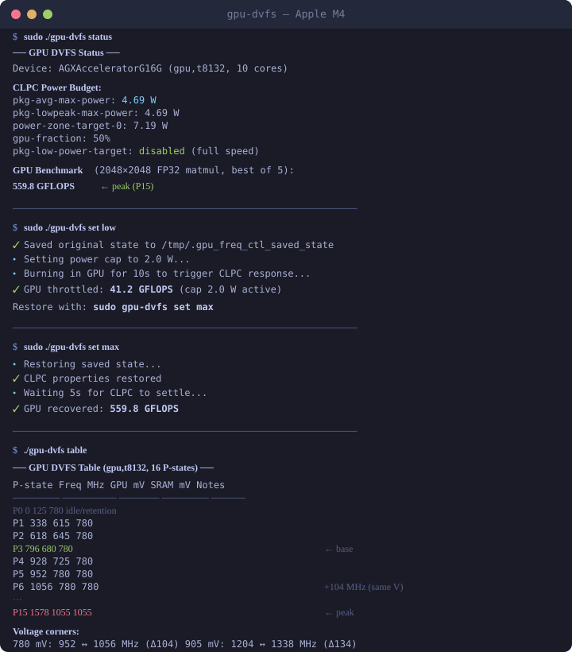

# Apple Silicon GPU DVFS Control

Control your Mac's GPU frequency from the command line. Extract the full hardware
DVFS table, throttle the GPU to any power level, and restore it — all without
kernel extensions, SIP changes, or jailbreaking.

Works on **M1, M2, M3, and M4** Macs.

<p align="center">
  
</p>

## Requirements

- macOS on Apple Silicon (M1/M2/M3/M4)
- Xcode Command Line Tools (`xcode-select --install`)
- `sudo` for frequency control (not needed for `table` or `info`)

## Install

```bash
git clone https://github.com/maderix/apple-gpu-dvfs.git
cd apple-gpu-dvfs

# Option A: use the wrapper (auto-builds on first run)
./gpu-dvfs info

# Option B: build manually
xcrun clang -framework IOKit -framework Foundation -framework Metal -O2 \
  -o gpu_freq_ctl gpu_freq_ctl.m
```

## Usage

### Set GPU power level (named presets)

The easiest way to control GPU frequency:

```bash
sudo ./gpu-dvfs set low       # Throttle to 2W → ~338 MHz
sudo ./gpu-dvfs set medium    # Throttle to 5W → ~950 MHz
sudo ./gpu-dvfs set high      # Throttle to 10W → ~1300 MHz
sudo ./gpu-dvfs set max       # Restore full speed
```

| Preset | Power | Approx Freq | GFLOPS |
|--------|-------|-------------|--------|
| `min` | 1W | 338 MHz (P1) | ~41 |
| `low` | 2W | 338 MHz (P1) | ~41 |
| `medium` | 5W | ~950 MHz (P5-P6) | ~200 |
| `high` | 10W | ~1300 MHz (P12-P14) | ~370 |
| `max` | uncap | 1578 MHz (P15) | ~560 |

You can also pass a watt value directly: `sudo ./gpu-dvfs set 3.5`

### Other commands

```bash
./gpu-dvfs info              # SoC, GPU class, core count (no sudo)
./gpu-dvfs table             # Full P-state table from device tree (no sudo)
sudo ./gpu-dvfs status       # CLPC power budget + measured GPU speed
sudo ./gpu-dvfs cap 2        # Raw power cap in watts
sudo ./gpu-dvfs uncap        # Restore saved state
sudo ./gpu-dvfs sweep        # Sweep 12 power levels, measure GFLOPS at each
sudo ./gpu-dvfs monitor      # Live frequency + power stream (powermetrics)
```

### Recovery

The tool saves CLPC state before any change. `set max` or `uncap` restores it.
If the GPU stays throttled (rare, caused by CLPC PID integrator state):
```bash
sudo pmset sleepnow     # sleep/wake resets CLPC firmware
```

### Options

| Flag | Effect |
|------|--------|
| `-v`, `--verbose` | Show IOKit calls and raw property values |
| `--confirm` | Run powermetrics after cap/uncap to verify frequency |
| `--no-burn` | Skip 10s GPU burn-in during cap (faster, less reliable) |
| `--no-color` | Disable colored output |

---

## How it works

### The CLPC

Apple Silicon DVFS is managed by the **CLPC** (Closed Loop Performance Controller),
a kernel driver (`AppleT8132CLPC` on M4) that implements a PID controller tracking
package power consumption. It adjusts GPU voltage/frequency states to keep power
within a configured budget.

The CLPC exposes writable properties via IOKit's `IORegistryEntrySetCFProperties`.
The key property is:

| Property | Default | Effect |
|----------|---------|--------|
| `` `pkg-low-power-target `` | -16777216 (disabled) | Target power level. Set to watts × 1048576 to throttle. |

Setting this to a positive value forces the CLPC to converge on that power level,
which selects the appropriate P-state. Setting it back to -16777216 removes the
target.

Additional properties fine-tune the budget:

| Property | Default (M4) | Effect |
|----------|-------------|--------|
| `~pkg-avg-max-power` | 4915200 (4.69W) | Average power cap |
| `~pkg-lowpeak-max-power` | 4915200 (4.69W) | Low-peak cap |
| `~pkg-power-zone-target-0` | 7536640 (7.19W) | Power zone target |
| `~pkg-power-split-gpu-fraction` | 32768 (50%) | GPU's share of budget |

The tool saves and restores **all 20 writable CLPC properties** (including PID
controller gains) to ensure clean recovery.

### DVFS P-state table

The GPU's voltage/frequency operating points are stored in the macOS device tree
as the `perf-states` property on the `sgx` node. Each entry is 8 bytes:
`[frequency_Hz (u32), voltage_mV (u32)]`.

Example (M4, 10-core GPU, `gpu,t8132`):

```
P0  (idle)    0 MHz     125 mV   SRAM  780 mV
P1          338 MHz     615 mV   SRAM  780 mV
P2          618 MHz     645 mV   SRAM  780 mV
P3  (base)  796 MHz     680 mV   SRAM  780 mV   ← gpu-perf-base-pstate
P4          928 MHz     725 mV   SRAM  780 mV
P5          952 MHz     780 mV   SRAM  780 mV   ┐ Corner A
P6         1056 MHz     780 mV   SRAM  780 mV   ┘ +104 MHz, same voltage
P7         1053 MHz     835 mV   SRAM  835 mV   ┐ Corner B
P8         1170 MHz     835 mV   SRAM  835 mV   ┘ +117 MHz
P9         1152 MHz     875 mV   SRAM  875 mV   ┐ Corner C
P10        1278 MHz     875 mV   SRAM  875 mV   ┘ +126 MHz
P11        1204 MHz     905 mV   SRAM  905 mV   ┐ Corner D
P12        1338 MHz     905 mV   SRAM  905 mV   ┘ +134 MHz
P13        1326 MHz     980 mV   SRAM  980 mV   ┐ Corner E
P14        1470 MHz     980 mV   SRAM  980 mV   ┘ +144 MHz
P15 (peak) 1578 MHz    1055 mV   SRAM 1055 mV
```

### Voltage corners

Five voltage levels (780–980 mV) each support two clock frequencies: a "lo"
(energy-efficient) and "hi" (max that passes timing at that voltage). The
frequency delta grows with voltage — 104 MHz at 780 mV up to 144 MHz at 980 mV —
reflecting wider timing margin at higher voltage.

### SRAM retention floor

SRAM voltage holds at 780 mV for P0–P6 even as GPU logic voltage goes lower.
From P7 onward they match. This means the GPU's register files and on-chip
caches have a 780 mV floor; only the combinational logic scales below it.

### Observed DVFS behavior

The CLPC operates in a nearly binary mode: light loads stay at **P3 (796 MHz)**
(the `gpu-perf-base-pstate`), and any substantial compute jumps directly to
**P15 (1578 MHz)**. Power within P15 scales from ~2.5W to ~16W via clock/power
gating across GPU cores — the CLPC doesn't step through intermediate P-states
for power management; it gates cores at max frequency instead.

### Measured sweep results (M4)

| Power cap | GFLOPS | Ratio |
|-----------|--------|-------|
| 15.0 W | 427 | 100% |
| 10.0 W | 369 | 86% |
| 8.0 W | 331 | 78% |
| 6.0 W | 204 | 48% |
| 5.0 W | 202 | 47% |
| 4.0 W | 174 | 41% |
| 3.5 W | 103 | 24% |
| 3.0 W | 69 | 16% |
| 2.5 W | 64 | 15% |
| 2.0 W | 41 | 10% |
| 1.5 W | 42 | 10% |
| 1.0 W | 41 | 10% |
| uncap | 560 | — |

The floor at ~41 GFLOPS (1–2W) corresponds to P1 (338 MHz), the lowest active
P-state.

---

## Compatibility

The device tree format and CLPC interface are consistent across Apple Silicon:

| SoC | Device tree | CLPC driver | Status |
|-----|------------|-------------|--------|
| M1 | `gpu,t8103` | AppleT8103CLPC | Should work (same IOKit interface) |
| M2 | `gpu,t8112` | AppleT8112CLPC | Should work |
| M3 | `gpu,t8122` | AppleT8122CLPC | Should work |
| **M4** | **`gpu,t8132`** | **AppleT8132CLPC** | **Tested and verified** |

The tool auto-detects the SoC from the device tree and adapts. Default CLPC
values differ per chip — the tool saves/restores the actual values it reads,
so it's safe on any model.

M1 Pro/Max/Ultra, M2 Pro/Max/Ultra, M3 Pro/Max/Ultra, and M4 Pro/Max should
also work — they share the same CLPC driver within each generation and use the
same `perf-states` format, with different P-state counts and frequencies.

**If you test on a non-M4 chip**, please open an issue with the output of
`./gpu-dvfs info` and `./gpu-dvfs table` so we can confirm compatibility.

---

## Extraction method (manual)

If you want to read the DVFS table without this tool:

```bash
# Find the GPU device tree node
ioreg -l -w 0 -r -c AppleARMIODevice | grep -B5 -A200 '"device_type" = <"sgx">'

# Decode the perf-states blob
python3 -c "
import struct
# paste the hex from the 'perf-states' property here
blob = bytes.fromhex('000000007d000000807825146702000080eed524...')
for i in range(len(blob) // 8):
    freq, mv = struct.unpack_from('<II', blob, i * 8)
    print(f'P{i}: {freq / 1e6:.0f} MHz  {mv} mV')
"
```

Key device tree properties:
- `perf-states` — P-state table (8 bytes each: freq + voltage)
- `perf-states-sram` — same format, SRAM retention voltages
- `gpu-perf-base-pstate` — idle-active P-state index
- `perf-state-count` — total entries including idle

## Repository structure

```
gpu_freq_ctl.m        Main tool — CLPC control, DVFS extraction, GPU benchmark
gpu-dvfs              Shell wrapper — auto-build, sudo handling, live monitor
matmul_dvfs_bench.m   Standalone matmul benchmark showing DVFS scaling
gpu_dvfs_bench.m      ALU stress sweep with powermetrics
gpu_dvfs_bench_v2.m   Duty-cycling sweep for lower P-states
parse_dvfs_results.py Powermetrics log parser
docs/index.html       Interactive report with charts
experiments/          IOKit probes from the reverse engineering process
```

## Caveats

- **This is reverse engineering.** Apple can change the CLPC interface in any
  macOS update. The tool reads/writes IOKit properties that are not documented.
- **Power caps affect the whole package**, not just the GPU. CPU performance
  may also be affected at very low caps.
- **The CLPC PID controller has long time constants** (~15 min input TC). After
  aggressive throttling, recovery can take a few seconds. If stuck, sleep/wake
  resets the firmware state instantly.
- **No direct P-state selection.** The tool controls power budget, not
  frequency directly. The CLPC picks the P-state to meet the budget.

## License

MIT
