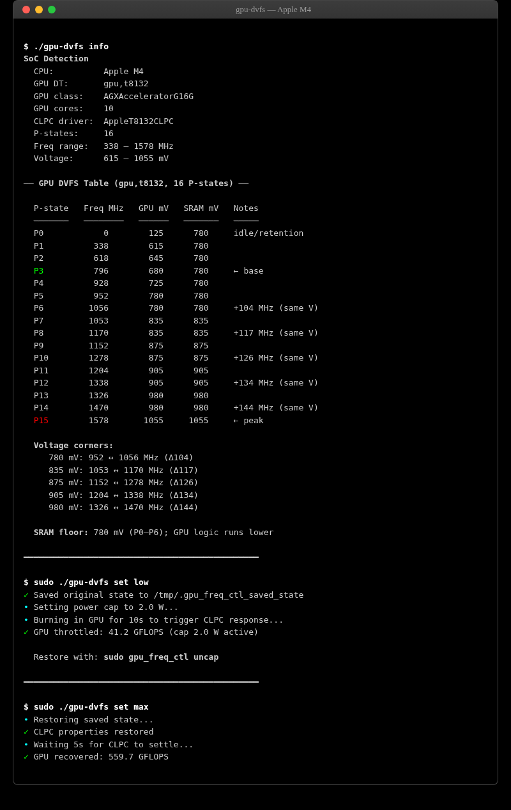

# Apple Silicon GPU DVFS Control

Control your Mac's GPU frequency from the command line. Cap GPU power to any
watt level, extract the full hardware DVFS table, and restore instantly — all
without kernel extensions, SIP changes, or jailbreaking.

Works on **M1, M2, M3, M4, and M5** Macs.

<p align="center">
  
</p>

## Requirements

- macOS on Apple Silicon (M1/M2/M3/M4/M5)
- Xcode Command Line Tools (`xcode-select --install`)
- `sudo` for frequency control (not needed for `table` or `info`)

## Install

```bash
git clone https://github.com/maderix/apple-gpu-dvfs.git
cd apple-gpu-dvfs

# Option A: use the wrapper (auto-builds on first run)
./gpu-dvfs info

# Option B: build manually
xcrun clang -framework IOKit -framework Foundation -framework Metal -O2 \
  -o gpu_freq_ctl gpu_freq_ctl.m
```

## Usage

### Set GPU power level (named presets)

```bash
sudo ./gpu-dvfs set low       # 2W cap
sudo ./gpu-dvfs set medium    # 10W cap
sudo ./gpu-dvfs set high      # 15W cap
sudo ./gpu-dvfs set max       # remove cap (full speed)
```

| Preset | Power | M4 GFLOPS | M5 Max GFLOPS |
|--------|-------|-----------|---------------|
| `min` | 1W | ~41 | ~592K |
| `low` | 2W | ~278 | — |
| `medium` | 10W | ~405 | ~988K |
| `high` | 15W | ~450 | ~1.24M |
| `max` | uncap | ~554 | ~2.75M |

You can also pass a watt value directly: `sudo ./gpu-dvfs set 7.5`

### Other commands

```bash
./gpu-dvfs info              # SoC, GPU class, core count (no sudo)
./gpu-dvfs table             # Full P-state table from device tree (no sudo)
sudo ./gpu-dvfs status       # AGX + CLPC state, measured GPU speed
sudo ./gpu-dvfs cap 5        # Raw power cap in watts
sudo ./gpu-dvfs uncap        # Restore saved power cap
sudo ./gpu-dvfs sweep        # Sweep power levels, measure GFLOPS at each
sudo ./gpu-dvfs monitor      # Live frequency + power stream (powermetrics)
```

### Recovery

The tool saves the original power cap before any change. `set max` or `uncap`
restores it instantly via the AGX path. No PID integrator issues — just a
register write.

### Options

| Flag | Effect |
|------|--------|
| `-v`, `--verbose` | Show IOKit calls and raw property values |
| `--confirm` | Run powermetrics after cap/uncap to verify frequency |
| `--no-burn` | Skip warm-up phase (faster) |
| `--clpc` | Force CLPC fallback path instead of AGX |
| `--no-color` | Disable colored output |

---

## How it works

### Primary: AGX `SetMaxGPUAbsolutePower` (recommended)

The AGX GPU driver exposes a writable power cap directly on the GPU service:

```objc
// Set GPU power cap to 5W (5000 mW)
CFMutableDictionaryRef d = CFDictionaryCreateMutable(...);
CFDictionarySetValue(d, CFSTR("SetMaxGPUAbsolutePower"), kCFBooleanTrue);
CFDictionarySetValue(d, CFSTR("AbsoluteTarget"), /* 5000 */);
IORegistryEntrySetCFProperties(agx_service, d);
```

| Property | Access | Description |
|----------|--------|-------------|
| `MaxGPUAbsolutePower` | read | Current power cap (mW) |
| `SetMaxGPUAbsolutePower` | write (trigger) | Set to `true` with `AbsoluteTarget` |
| `AbsoluteTarget` | write | Target power in milliwatts |
| `FilteredGPUPower` | read | Real-time GPU power draw (mW) |

This is **GPU-only** (doesn't affect CPU), **instant** (no PID lag), and works
on both M4 (`AGXAcceleratorG16G`) and M5 (`AGXAcceleratorG17X`).

### Fallback: CLPC `pkg-low-power-target`

If the AGX path fails, the tool falls back to the CLPC (Closed Loop Performance
Controller). This works on M1–M4 but:

- Affects the **whole package** (CPU + GPU)
- Has **PID integrator lag** (~15 min time constant)
- Requires restoring `pkg-low-power-target` to -16777216 to uncap
- If stuck: `sudo pmset sleepnow` resets CLPC firmware state

Pass `--clpc` to force this path.

### Last resort: `pmset lowpowermode`

```bash
sudo pmset -a lowpowermode 1    # ~50% GPU throttle, system-wide
sudo pmset -a lowpowermode 0    # restore
```

Binary (on/off), but it's a public macOS API that works everywhere.

### DVFS P-state table

The GPU's voltage/frequency operating points are in the macOS device tree as
the `perf-states` property on the `sgx` node. Each entry is 8 bytes:
`[frequency_Hz (u32), voltage_mV (u32)]`.

Example (M4, 10-core GPU, `gpu,t8132`):

```
P0  (idle)    0 MHz     125 mV   SRAM  780 mV
P1          338 MHz     615 mV   SRAM  780 mV
P2          618 MHz     645 mV   SRAM  780 mV
P3  (base)  796 MHz     680 mV   SRAM  780 mV   ← gpu-perf-base-pstate
P4          928 MHz     725 mV   SRAM  780 mV
P5          952 MHz     780 mV   SRAM  780 mV   ┐ Corner A
P6         1056 MHz     780 mV   SRAM  780 mV   ┘ +104 MHz, same voltage
P7         1053 MHz     835 mV   SRAM  835 mV   ┐ Corner B
P8         1170 MHz     835 mV   SRAM  835 mV   ┘ +117 MHz
P9         1152 MHz     875 mV   SRAM  875 mV   ┐ Corner C
P10        1278 MHz     875 mV   SRAM  875 mV   ┘ +126 MHz
P11        1204 MHz     905 mV   SRAM  905 mV   ┐ Corner D
P12        1338 MHz     905 mV   SRAM  905 mV   ┘ +134 MHz
P13        1326 MHz     980 mV   SRAM  980 mV   ┐ Corner E
P14        1470 MHz     980 mV   SRAM  980 mV   ┘ +144 MHz
P15 (peak) 1578 MHz    1055 mV   SRAM 1055 mV
```

### Measured sweep results

**M4 (AGX path, SetMaxGPUAbsolutePower):**

| Cap | GFLOPS | Filtered Power |
|-----|--------|----------------|
| 20W (default) | 476 | 7911 mW |
| 15W | 450 | 8272 mW |
| 10W | 405 | 7436 mW |
| 5W | 355 | 6012 mW |
| 2W | 278 | 2839 mW |
| Restored | **554** | — |

**M5 Max 128GB** (community-verified by @Beamsters1):

| Cap | Settled Freq | Power | GFLOPS |
|-----|-------------|-------|--------|
| 5W | 338 MHz | 5014 mW | 591,631 |
| 10W | 568 MHz | 10,844 mW | 988,381 |
| 15W | 724 MHz | 15,037 mW | 1,238,424 |
| 20W | 876 MHz | 20,015 mW | 1,502,060 |
| uncap | 1620 MHz | ~94W | ~2,750,000 |

---

## Compatibility

| SoC | AGX class | AGX power cap | CLPC fallback | Status |
|-----|-----------|---------------|---------------|--------|
| M1 | AGXAcceleratorG13G | Should work | Yes | Untested |
| M2 | AGXAcceleratorG15G | Should work | Yes | Untested |
| M3 | AGXAcceleratorG15X | Should work | Yes | Untested |
| **M4** | **AGXAcceleratorG16G** | **Yes** | **Yes** | **Verified** |
| **M5** | **AGXAcceleratorG17X** | **Yes** | Unknown | **Community verified** |

The tool auto-detects the SoC and AGX class. Pro/Max/Ultra variants within each
generation share the same driver and interface.

**If you test on a non-M4 chip**, please open an issue with `./gpu-dvfs info`
and `./gpu-dvfs table` output.

---

## Extraction method (manual)

```bash
# Find the GPU device tree node
ioreg -l -w 0 -r -c AppleARMIODevice | grep -B5 -A200 '"device_type" = <"sgx">'

# Decode the perf-states blob
python3 -c "
import struct
blob = bytes.fromhex('...')  # paste hex from perf-states
for i in range(len(blob) // 8):
    freq, mv = struct.unpack_from('<II', blob, i * 8)
    print(f'P{i}: {freq / 1e6:.0f} MHz  {mv} mV')
"
```

## Repository structure

```
gpu_freq_ctl.m          Main tool — AGX power cap + CLPC fallback + benchmarks
gpu-dvfs                Shell wrapper — auto-build, named presets, sudo handling
matmul_dvfs_bench.m     Tiled FP32 matmul — DVFS scaling demo (~560 GFLOPS peak)
matmul_mma_bench.m      Simdgroup MMA matmul — near-peak throughput (~3.4 TFLOPS)
gpu_dvfs_bench.m        ALU stress sweep with powermetrics
gpu_dvfs_bench_v2.m     Duty-cycling sweep for lower P-states
parse_dvfs_results.py   Powermetrics log parser
docs/index.html         Interactive report with charts
experiments/            IOKit probes from the reverse engineering process
```

### Benchmark notes

- **`matmul_dvfs_bench.m`** — naive 16×16 tiled kernel (~560 GFLOPS). Shows DVFS
  scaling, not peak throughput.
- **`matmul_mma_bench.m`** — uses `simdgroup_matrix_multiply_accumulate` for
  **3.4 TFLOPS** (74% of M4's ~4.6 TFLOPS FP32 peak).

## Caveats

- **Reverse engineering.** Apple can change AGX/CLPC interfaces in any macOS update.
- **AGX power cap affects GPU only.** CLPC fallback affects the whole package.
- **No direct P-state selection.** The tool controls power budget; firmware picks
  the P-state.
- **The CLPC PID controller has long time constants.** If using the CLPC fallback
  and the GPU gets stuck throttled, `sudo pmset sleepnow` resets the firmware.

## License

MIT
